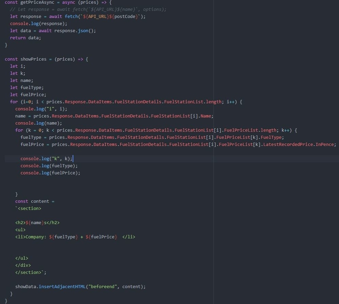
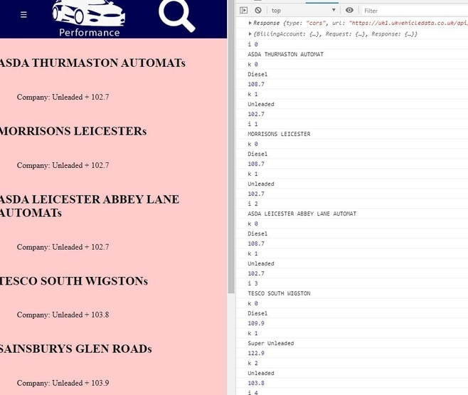
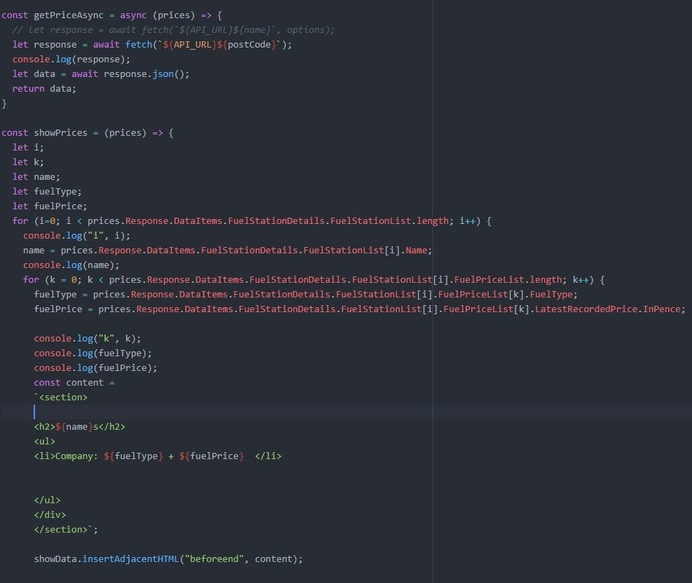
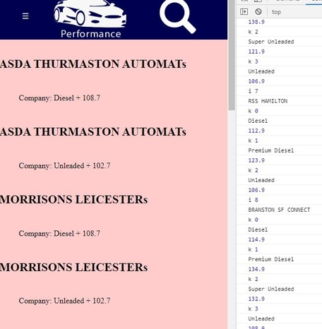
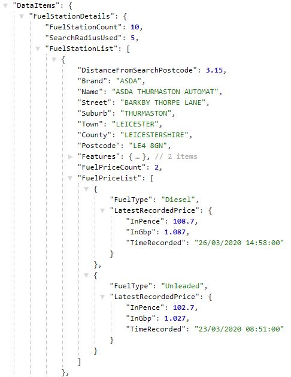

# Performance Car Site

## Resources
https://www.codecademy.com/learn/learn-html

https://www.codecademy.com/learn/introduction-to-javascript
## html

## CSS

## JavaScript

## Slideshow
[Slideshow Code] (https://www.w3schools.com/howto/howto_js_slideshow.asp)
I used the above W3schools tutorial for my slideshow but did amend it for ES6 JavaScript and for multiple simultaneous slideshow's.
## Navbar

## API - Fuel Price

I have used an API that find the prices of fuel at local petrol stations
As it is an API that is free to use on a trial, there are some limitations. Only postcode will the letter 'a' in it will return a result

Some postcodes to try:

* LE2 7AJ
* LE11 3QA
* TR26 3AG
* BA80TN
* W1H 6AY

### Issues
The code bellow show my first attempts at trying to trying to bring over the api data. I had issues as the data was nested as shown in the screenshot below. It was not displaying it as I wanted with a lot of duplicated data.

First attempt was not getting all the data:

Second attempt was duplicating the name of the fuel station:

Nested API JSON Data:

